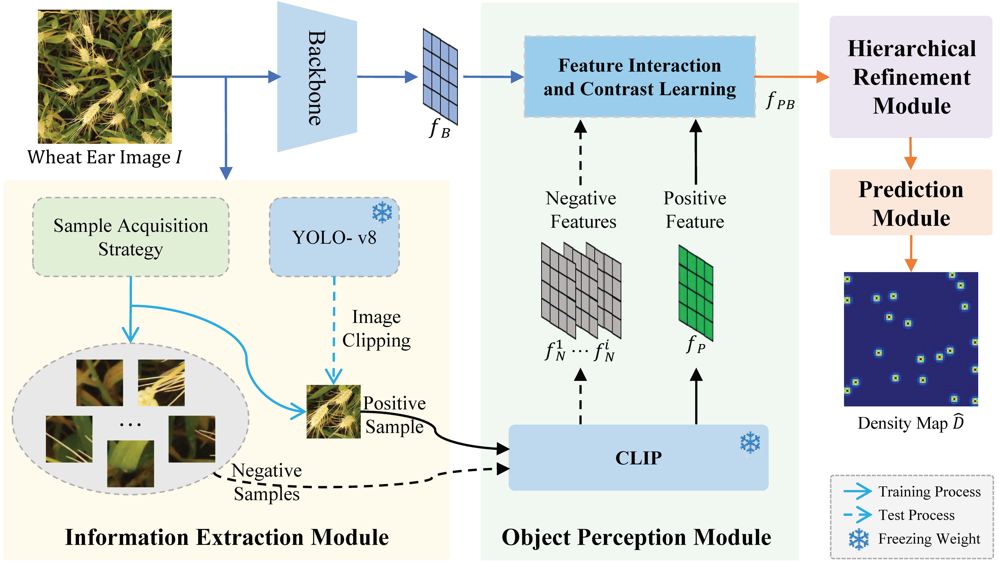

# WheatCLIP

**WheatCLIP** is a wheat ear counting framework that uses large models and contrastive learning for feature enhancement.

paper: WheatCLIP: Object-Aware Wheat Ear Counting with Contrast Learning and Universal Knowledge Model
## The Overview of WheatCLIP



## About Data
We use the global wheat Head Detection 2021 ([dataset](http://www.global-wheat.com/gwhd.html)) for training.
The density map is marked in the annotation.zip compressed package.

## Code Structure
`train.py` To train the model. 

`test.py` To test the model. 

## Training
### Step1  
Please divide the data set according to the csv file.

### Step2
Change the dataset path in the train.py file to the location of the dataset.

### Step3
```shell
python train.py
```
## Testing
### Step1
Please download the weights in the current directory.
### Step2
Please change the relevant path in the test.py file
### Step3
```shell
python test.py 
```
# Weight
 [Here](https://pan.baidu.com/s/1Ts6YQszzqiltmb9FTSvHuA?pwd=9fgn) are the trained WheatCLIP weights, the first ten layers of VGG16 weights, and the fine-tuned YOLOv8 weights.
